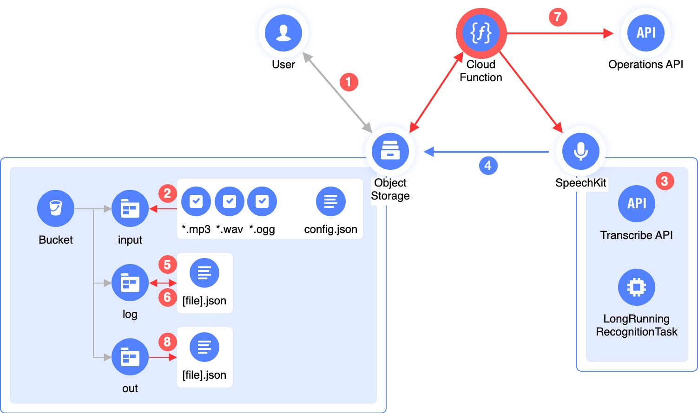

# SpeechKit Asynchronous Batch Recognizer

This script retrieves audio files from an [Object Storage](https://yandex.cloud/services/storage) bucket, sends them to [SpeechKit](https://yandex.cloud/services/speechkit) for recognition, and then saves the recognition results back to the Object Storage [bucket](https://yandex.cloud/docs/storage/concepts/bucket).

Long audios are recognized asynchronously, so make sure to save the audio file `operation-id` after the initial submission, and then regularly check the job status. 
If the job is complete, you can save the result and exclude the file from future job status checks.

Written in Python, this script can be easily analyzed, customized, and optimized for your specific use case.
<br><br>

## Recognition steps


<br><br>

1. Upload audio files in a [supported format](https://yandex.cloud/docs/speechkit/formats) to the `input` directory (prefix) in the Object Storage bucket. You can also upload a file named `config.json` to set the [language](https://yandex.cloud/docs/speechkit/stt/models) for speech recognition (by default, or if no `config.json` file is provided, Russian `[ru-RU]` is used). 

    The `config.json` file is simply formatted and only contains one JSON parameter:
    ```
    {
        'lang': 'ru-RU'
    }
    ```

2. The script checks the contents of the `input` folder in the bucket, generates a list of files for recognition, skipping unsupported formats and files already being recognized (by checking the `log` folder for the files in question). The folder is also checked for `config.json`, and further recognition employs the language specified in the file, if any.

3. The script sends [direct links](https://yandex.cloud/docs/storage/concepts/pre-signed-urls) to the files from the list it compiled earlier, to Transcribe API.

4. SpeechKit retrieves the file from the bucket using the signed link, creates a `LongRunningRecognitionTask` job, and returns the ID of the recognition operation.

5. This recognition operation ID is stored in the `log` folder, for each of the files sent for processing.

6. From time to time, depending on its run schedule, the script checks the `log` folder for audio files in progress, i.e., being recognized.

7. If a file contains the `{'done': 'false'}` parameter, the script sends the respective operation ID to Operations API to check the operation status.

8. If the operation is completed, the operation result is saved to the `out` folder as a JSON file, and the similar file in the `log` folder is changed to a file containing `{'done': 'true'}` to exclude it from further checks of the operation status.

## Usage

You can run this script locally. To do this, specify the following environment variables:

| Variable        | Description 
| -------------     | ------------- 
| S3_BUCKET         | [Bucket](https://yandex.cloud/docs/storage/concepts/bucket) name in Object Storage
| S3_PREFIX         | Prefix (or directory) for incoming files, e.g., `input`.
| S3_PREFIX_LOG     | Prefix (or directory) for files being processed, e.g., `log`.
| S3_PREFIX_OUT     | Prefix (or directory) for processing results, e.g., `out`.
| S3_KEY            | [Static access key](https://yandex.cloud/docs/iam/operations/sa/create-access-key) ID.
| S3_SECRET         | [Static access key](https://yandex.cloud/docs/iam/operations/sa/create-access-key) secret.
| API_SECRET        | [API key](https://yandex.cloud/docs/iam/operations/api-key/create) secret.

We recommend separating files being processed, processed files, and files for processing by using different prefixes (subfolders). Failing to do so may lead to unpredictable behavior.

To generate both an S3 key and an API key, [create a service account](https://yandex.cloud/docs/iam/operations/sa/create) and [assign](https://yandex.cloud/docs/iam/operations/sa/assign-role-for-sa) the `storage.editor` and `ai.speechkit-stt.user` roles.
<br><br>

## Use cases

You can leverage a ready-to-use [Terraform module](examples/asr-batch-function) that creates all required resources to start processing long audio files.

You can also set up [cronjob](examples/k8s-cronjob) for Kubernetes to run scheduled processing of incoming files.
